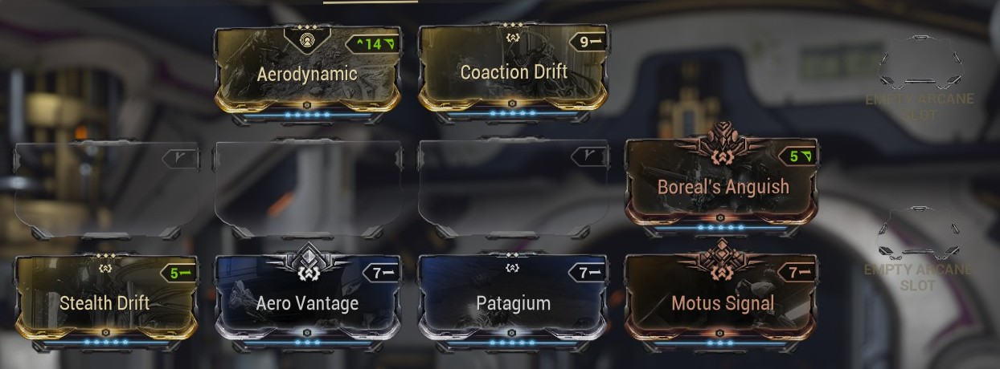
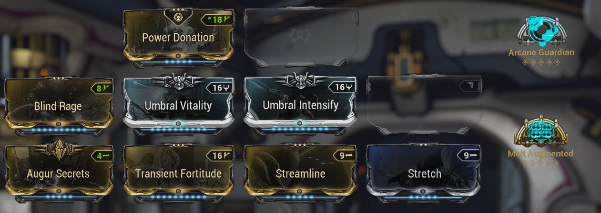
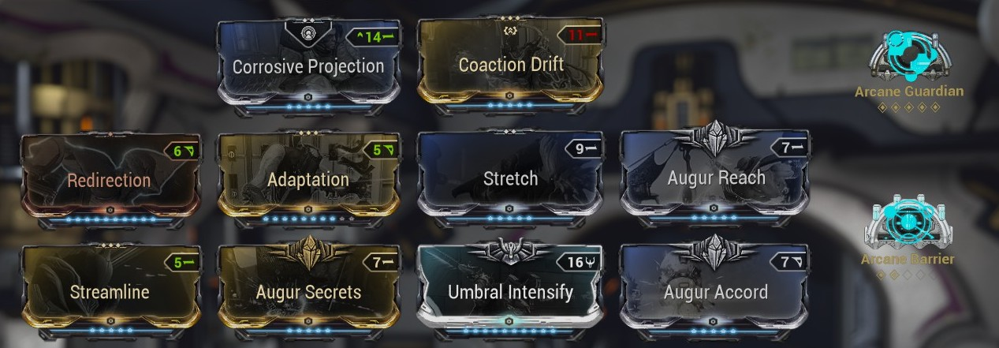
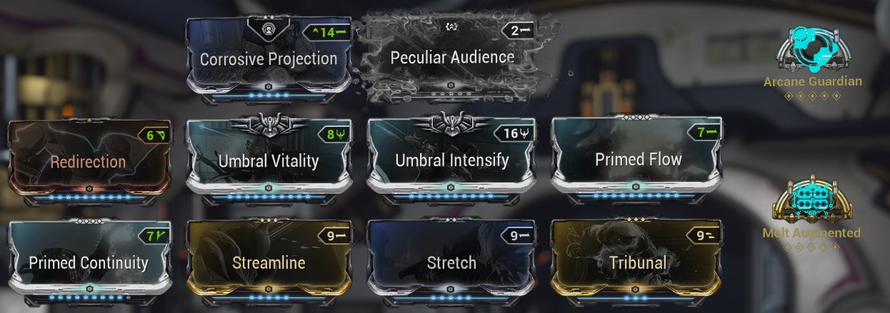

# Shedu Build 

\* `Ammo Drum` instead of `Hush`

# Mirage Prime Nuke 

<b>Archon Shards:</b>
- 1 Energy Max
- 4 Ability Stregth

<b>Subsumed abilities:</b>
- `Pillage` instead of `Prism` (?)

<b>Focus:</b> Vazarin for increased shared affinity

# Mirage Prime Damage 

# Floating Zephyr Prime 

# Volt Prime Circuit 

# Nidus Prime Specter 

# Hyldrin Prime 

# Harrow Prime Support 

# Chroma Prime Eidolon 

# Ash Prime Circuit 
